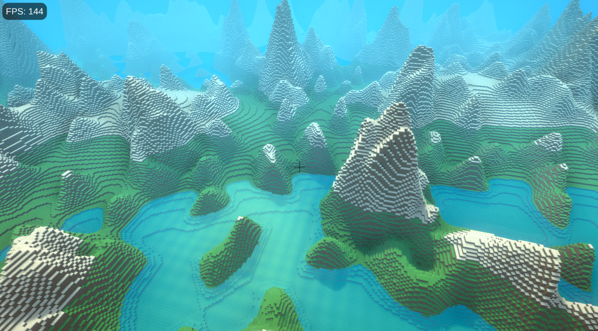
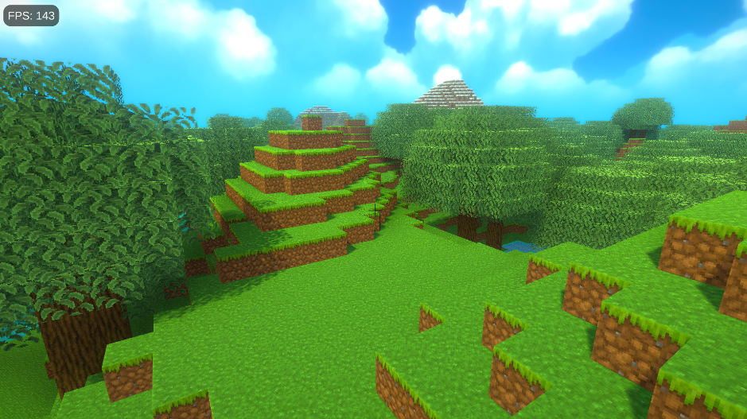
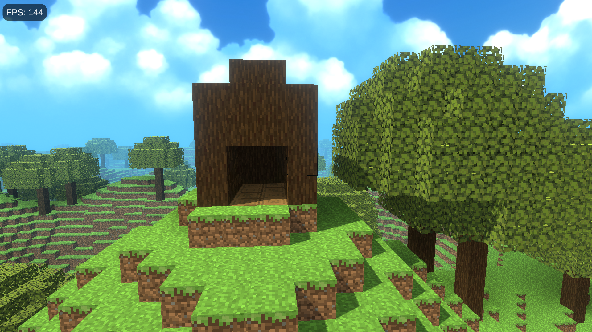
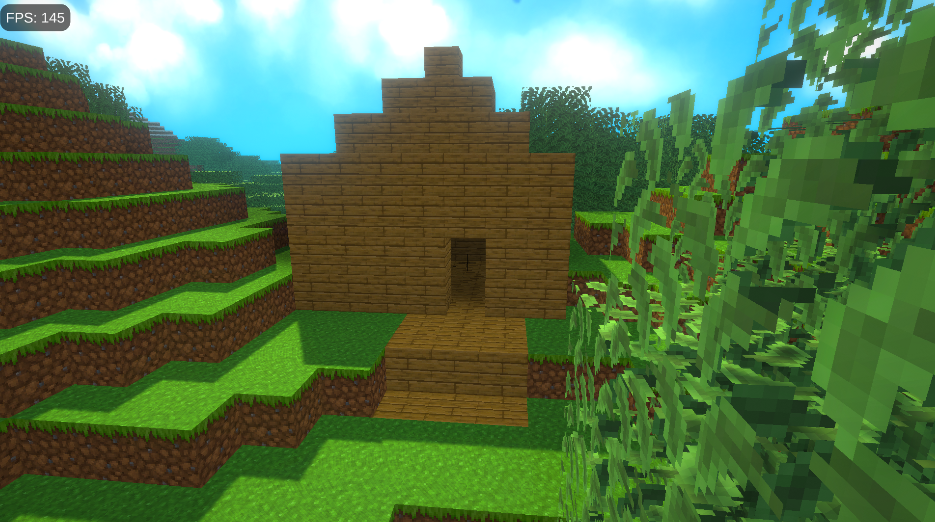

# Simple C# Unity Minecraft Clone
A lightweight Minecraft Clone made with Unity and C#, featuring cubic chunk generation, meaning there are no limits on the X, Y, or Z axis.

## Terrain Generation
- Caves
- Mountains
- Trees
- Lakes

## Controls
- Move: `WASD`
- Place Block: Right Mouse Button (0.1s interval)
- Destroy Block: Left Mouse Button (0.1s interval)
- Fly: Double-Tap `Space` (0.2s interval)
- Toggle Spectator Mode: `F1`

## Gameplay Screenshots

  
  
  
  

## Credits
- Texture Pack: https://www.planetminecraft.com/texture-pack/echonilla-smooth-vanilla-32x/
